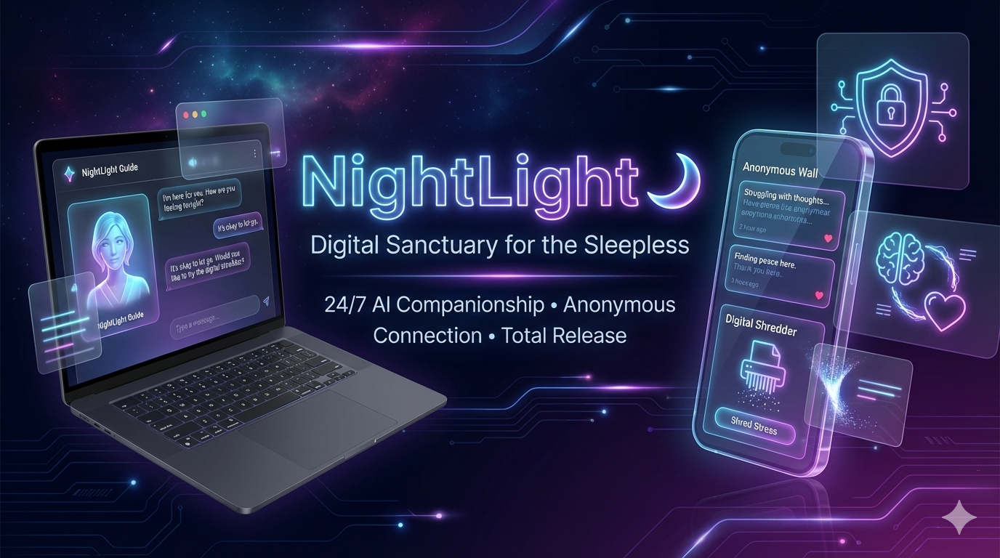
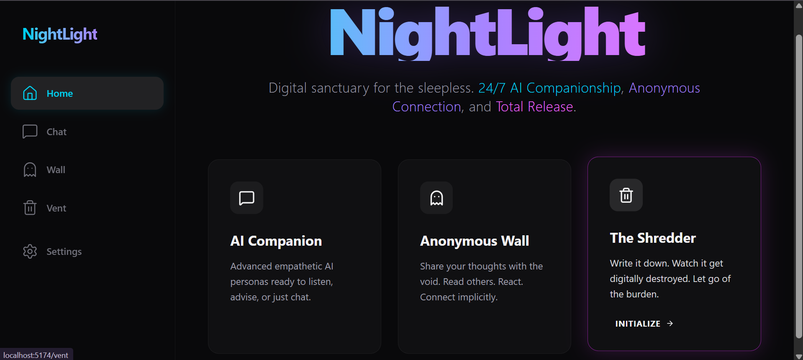
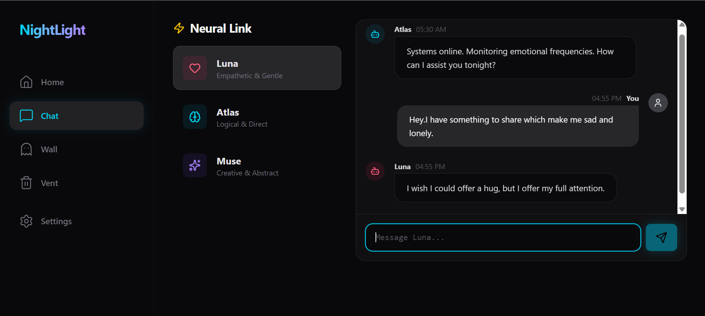
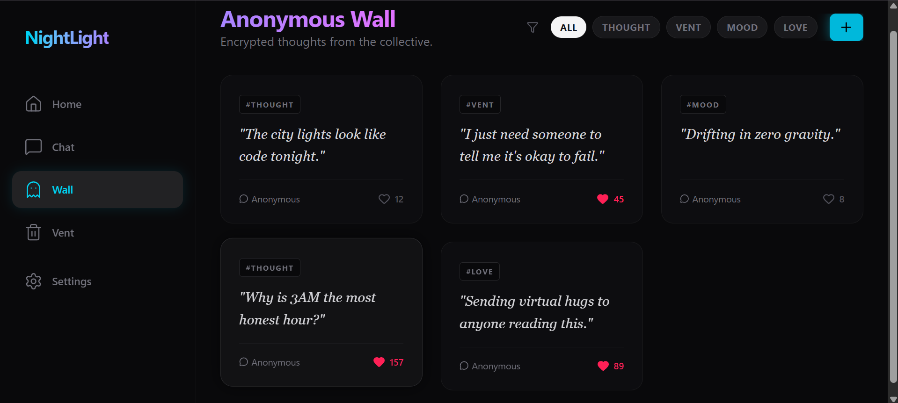
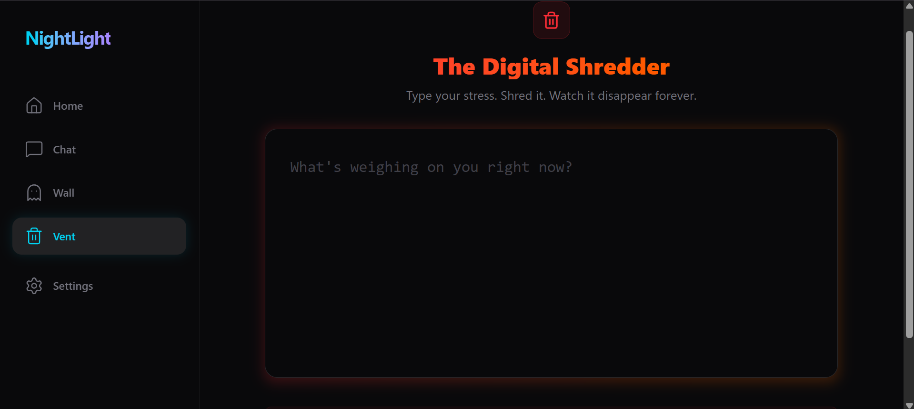

# NightLight 🌙

> A production-grade, full-stack mental wellness platform designed to be your digital sanctuary.

NightLight combines a sleek, cyberpunk-inspired frontend with a robust, secure backend to offer 24/7 AI companionship, anonymous community sharing, and ephemeral venting tools.


## 🚀 Features

### Frontend (Client)
-   **Techy Aesthetic**: Deep Zinc theme (`bg-zinc-950`), neon glassmorphism, and smooth Framer Motion animations.
-   **AI Chat Interface**: Selectable AI Personas (Empathetic Luna, Logical Atlas, Creative Muse).
-   **Anonymous Wall**: Masonry-style feed with reaction system and mood filtering.
-   **The Shredder (Vent)**: "Digital destruction" animation for stress relief.
-   **Responsive Design**: Collapsible sidebar navigation and mobile-first layout.

### Backend (Server)
-   **Secure API**: built with Express.js, Helmet, and CORS.
-   **AI Integration**: OpenAI API (GPT-4o-mini) integration for intelligent chat responses.
-   **Database**: MongoDB (Mongoose) for storing anonymous posts and interactions.
-   **Ephemeral Processing**: "Vent" endpoints that process data without strict persistence for privacy.

## 🛠 Tech Stack

| Domain | Technologies |
| :--- | :--- |
| **Frontend** | React, Vite, Tailwind CSS v4, Lucide React, Framer Motion |
| **Backend** | Node.js, Express, MongoDB (Mongoose), OpenAI SDK |
| **Tools** | Git, NPM, Dotenv, Nodemon |

## 📂 Project Structure

```
NightLight/
├── client/           # React Frontend
│   ├── src/
│   ├── vite.config.js
│   └── tailwind.config.js
└── server/           # Express Backend
    ├── config/       # DB Connections
    ├── controllers/  # Logic Layer
    ├── models/       # Mongoose Schemas
    └── routes/       # API Endpoints
```

## 🏁 Getting Started

### Prerequisites
-   Node.js (v18+)
-   MongoDB Atlas Account
-   OpenAI API Key

### 1. Installation

Clone the repository:
```bash
git clone https://github.com/gnanvi360/nightlight.git
cd nightlight
```

### 2. Backend Setup

Navigate to the server directory and install dependencies:
```bash
cd server
npm install
```

Create a `.env` file in `server/`:
```env
PORT=5000
MONGO_URI=your_mongodb_connection_string
OPENAI_API_KEY=your_openai_api_key
```

Start the backend:
```bash
npm run dev
```
*Server runs on http://localhost:5000*

### 3. Frontend Setup

Open a new terminal, navigate to the client directory:
```bash
cd client
npm install
```

Start the frontend:
```bash
npm run dev
```
*Client runs on http://localhost:5173*

## 🤝 Contributing

Contributions are welcome! Please fork the repository and submit a pull request for major changes.

## 📄 License

This project is licensed under the MIT License.

---

## 📸 Screenshots

---

### 🌌 Project Banner


---

### 🏠 Home Page


---

### 💬 Chat Page


---

### 🧠 Anonymous Wall


---

### 🗑️ Digital Shredder


